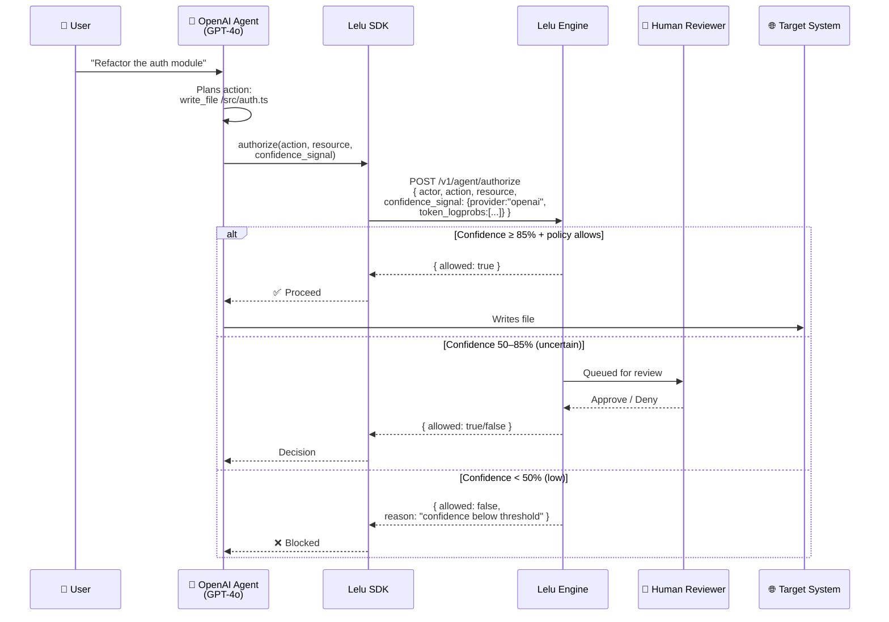
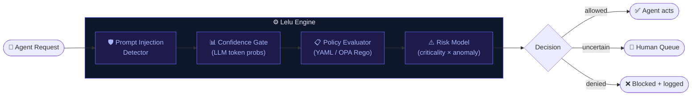
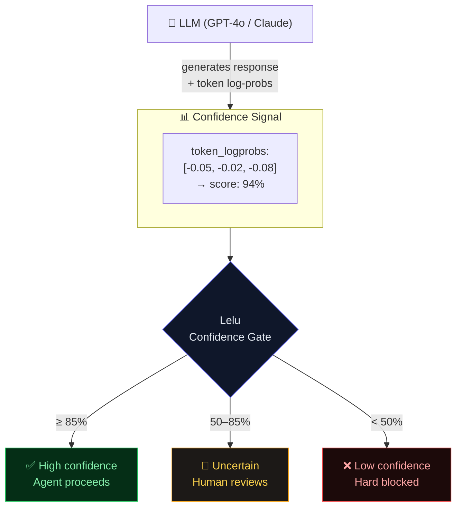

# Lelu LinkedIn Diagrams

---

## Diagram 1 — "How OpenAI Agents integrate with Lelu"
> Paste at https://mermaid.live → Export PNG (1200×628)

---

## Diagram 2 — "What happens inside Lelu" (pipeline)
> Clean flow showing the 4 layers

---

## Diagram 3 — "Before vs After Lelu" (problem/solution)

```mermaid
flowchart LR
    subgraph BEFORE["❌ Without Lelu"]
        direction TB
        A1[🤖 Agent] -->|no checks| S1[Production DB]
        A2[🤖 Agent] -->|no checks| S2[File System]
        A3[🤖 Agent] -->|no checks| S3[External API]
    end

    subgraph AFTER["✅ With Lelu"]
        direction TB
        B1[🤖 GPT-4o Agent] --> L[⚙️ Lelu\nAuthorization\nEngine]
        B2[🤖 Claude Agent] --> L
        B3[🤖 Custom Agent] --> L
        L -->|allowed| RS1[Production DB]
        L -->|allowed| RS2[File System]
        L -->|blocked| RS3[❌ Denied]
        L -->|review| RH[👥 Human]
    end

    style BEFORE fill:#1c0a0a,stroke:#ef4444
    style AFTER fill:#0a1c0a,stroke:#22c55e
    style L fill:#0f172a,color:#a5b4fc,stroke:#6366f1
```

---

## Diagram 4 — "Confidence Signal explained" (educational)

